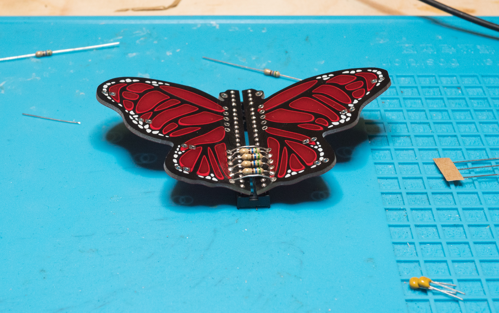
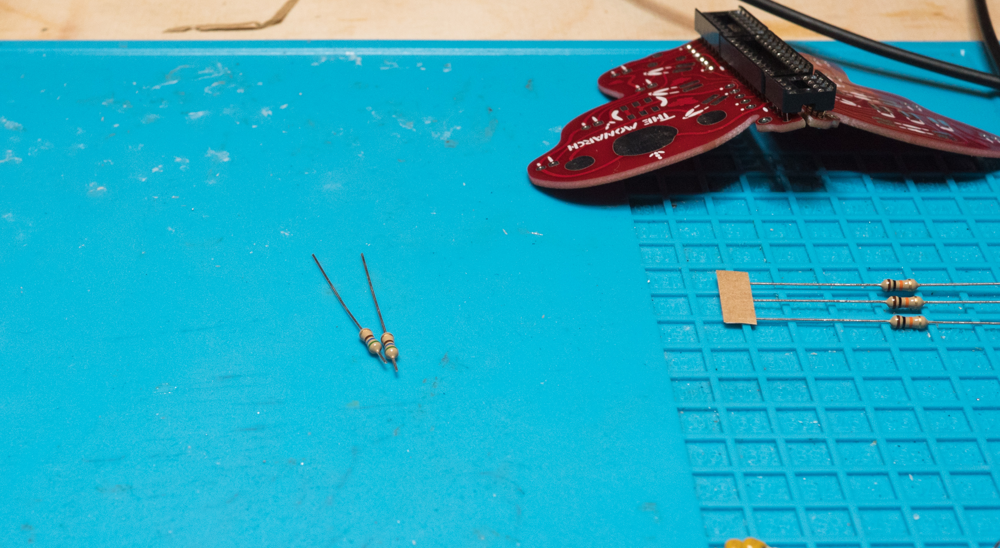
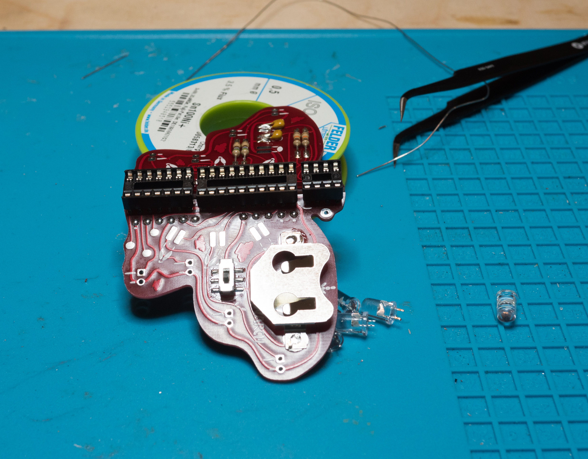
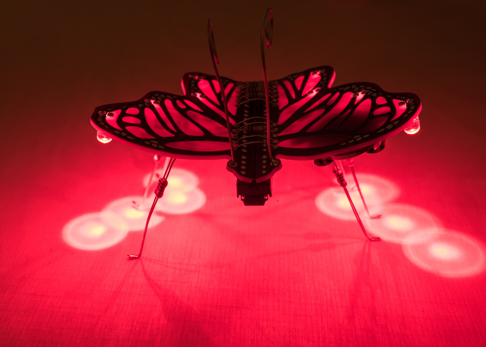

# p18-the_monarch

Build information around the Boldport Club project 18 - The Monarch -- or how to build the most beautiful butterfly you're ever going to build 😃

## The unveiling

## Bits & pieces

## Board preparation

To build this project it is necessary to part the board into two pieces and remove the remaining bridge parts using pliers.

Since I don't like sharp edges from the "mouse bites" I'm going to sand off the edges.

## Soldering the sockets

The two halves are kept together using the sockets at the bottom side and the resistors and wires at the top.
In order to being able to both connect the boards at an angle and and preventing ugly socket pins sticking out at the top
I'm using a protoboard shoved between board and socket to create a nice separation before soldering the sockets:

The same is repeated on the other side yielding this:

Continue the process for the other sockets:

## First round of cleaning

Since the solder joints are going to be hidden under the resistors and wires it's now time for the first round of cleaning.

## Current limiting resistors

The 8 LEDs require current limiting resistors, 2 are used per LED for a total of 16. 6 pairs are going to be the legs for the Monarch which I'm going to solder together first

## Creating the angle between the wings

Here comes the tricky part: The first resistors we're soldering at the top will define the angle the wings will stay in, so we need to bend the wings, place the resistor, hold everything in place and solder both ends of the the resistor at the same time. I find this easiest to accomplish by roughly soldering the resistor at the top (instead of the bottom).

And then I'm clipping the the legs at the bottom as close as possible to the board for the doming...

And I'm using my finger to bend the clippings to create the direct connections

## On board resistors

Next are the on-board resistors. For this I'm clipping the remaining resistors on one side after a few millimeters

The solder that short side to the board

Then clip the older side to fit, bend it down and solder it too

And then we're repeating that for the other resistors

## Finishing the top connections

At the top we're going to solder the remaining resistor and more clippings now:

## Deciding where to put the LEDs

In this build I decided to put the LEDs at the bottom and as close as possible to the board, so I clipped the legs of the LEDs at about 2mm.

## Soldering the SMD parts

The kit contains two real SMD parts: the switch and the battery holder. I'm starting with the latter and then add the switch **before** adding the LEDs.

## Adding the capacitors

Now it's time to add the capacitors, again clipped for a perfect placement:

## Make it shine

Now I'm going to add the LEDs. You have the option of putting them on top or bottom, having a little separation between boards and LEDs or not. I decided to go bottom and without distance this time:

## A monarch needs legs

After everything else is mounted it's finally time to add the legs. I've decided to to make the legs long and with sharply bent feet.

## Last step: the antennas

The antennas need some special attention. I've first straightened the single piece of 16cm wire and cut it exactly in two halves. Then I soldered them both onto the board and then curled them in...

## Firing it up

Now after putting all the chips and a battery in, let's see it in action...

