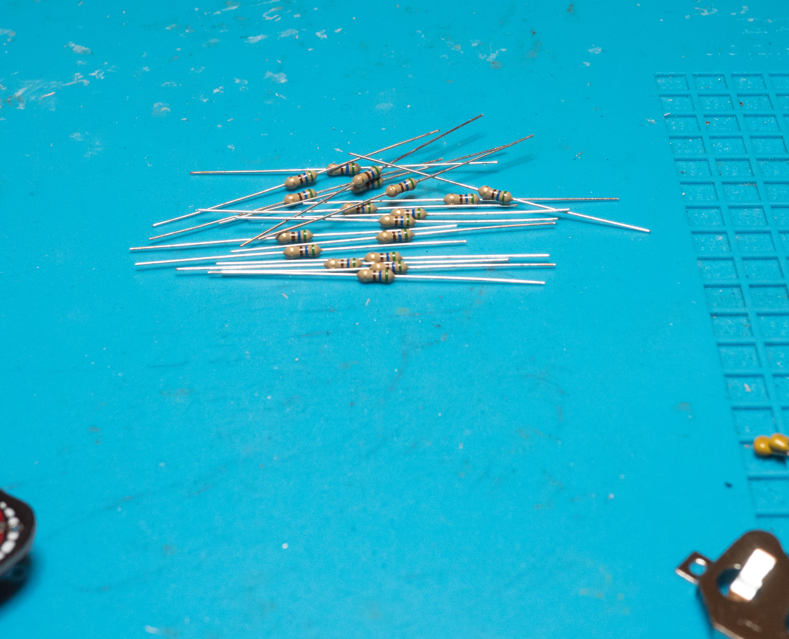
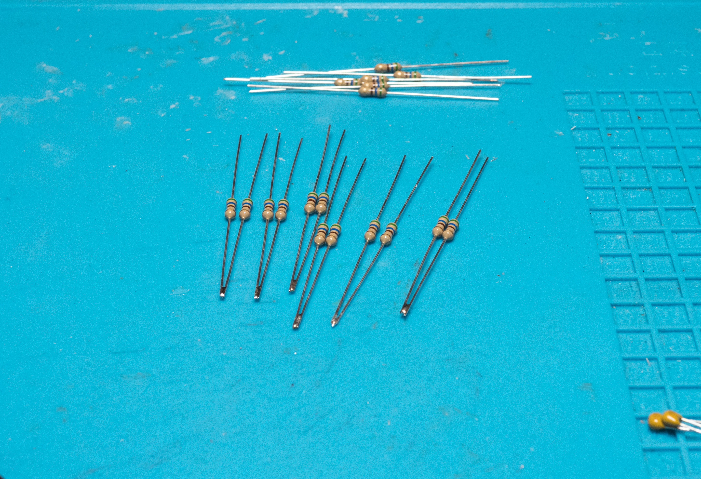

# p18-the_monarch

Build information around the Boldport Club project 18 - The Monarch -- or how to build the most beautiful butterfly you're ever going to build 😃

## The unveiling

## Bits & pieces

## Board preparation

To build this project it is necessary to part the board into two pieces and remove the remaining bridge parts using pliers.

Since I don't like sharp edges from the "mouse bites" I'm going to sand off the edges.

## Soldering the sockets

The two halves are kept together using the sockets at the bottom side and the resistors and wires at the top.
In order to being able to both connect the boards at an angle and and preventing ugly socket pins sticking out at the top
I'm using a protoboard shoved between board and socket to create a nice separation before soldering the sockets:

The same is repeated on the other side yielding this:

Continue the process for the other sockets:

## First round of cleaning

Since the solder joints are going to be hidden under the resistors and wires it's now time for the first round of cleaning.

## Current limiting resistors

The 8 LEDs require current limiting resistors, 2 are used per LED for a total of 16. 6 pairs are going to be the legs for the Monarch which I'm going to solder together first

